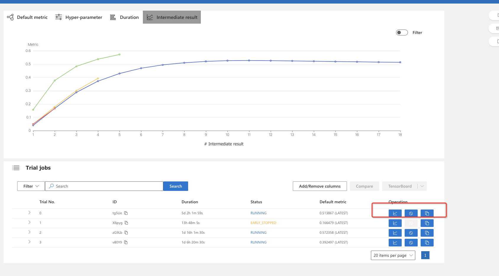

# PAI-NNI-HPO

## GetStarted

注意NNI仅支持python>=3.7,因此请配置python>=3.7的环境

NNI is tested and supported on Ubuntu >= 18.04, Windows 10 >= 21H2, and macOS >= 11.

### 下载安装easyrec

```bash
git clone https://github.com/alibaba/EasyRec.git
cd EasyRec
bash scripts/init.sh
python setup.py install
```

### 下载安装hpo-tools

bash install_hpo_tools.sh xxx

第一个参数为下载examples的位置，默认下载在输入路径下面的examples下；如果没写目录，默认生成在根目录下。

```
wget https://automl-nni.oss-cn-beijing.aliyuncs.com/nni/hpo_tools/scripts/install_hpo_tools.sh
bash install_hpo_tools.sh ./
cd ./examples/search/maxcompute_easyrec
```

## 启动调优

### 启动命令

```bash
nnictl create --config begin/config.yml --port=8780
```

其中port可以是机器上任意未使用的端口号。需要注意的是，NNI实验不会自动退出，如果需要关闭实验请运行nnictl stop主动关闭。
您也可以参考[NNI参考手册](https://nni.readthedocs.io/en/v2.1/Tutorial/QuickStart.html)
查看nnictl的更多用法。

启动成功界面：


#### config.yml 参数说明

config.yml是作为NNI的配置文件，将代码和搜索空间进行结合，并使用指定的环境来运行您的训练代码，具体参考此config.yml文件。在这里，您还可以还提供其他信息，例如并发度、调优算法、最大Trial数量和最大持续时间等参数。

```
experimentWorkingDirectory: ../expdir
searchSpaceFile: search_space.json
trialCommand: python3 ./run_begin.py --config=./config_begin.ini --exp_dir=../exp
trialConcurrency: 1
maxTrialNumber: 1
tuner:
  name: TPE
  classArgs:
    optimize_mode: maximize
debug: true
logLevel: debug
trainingService:
  platform: local
assessor:
   codeDirectory: ../../../core/assessor
   className: maxcompute_assessor.MaxComputeAssessor
   classArgs:
      optimize_mode: maximize
      start_step: 2
```

##### 并发度和最大Trial数量、最大运行时间可以实时调整：

建议：刚开始设置为1，调测代码成功后，可以先调大最大运行次数Max trial No.，再调大并发度Concurrency。


#### 配置 config_begin.ini

配置文件中包含oss配置、odps配置、easyrec命令配置、超参搜索评估方法配置。

```
[oss_config]
endpoint=http://oss-cn-beijing.aliyuncs.com
accessKeyID=xxx
accessKeySecret=xxx

[odps_config]
project_name=pai_rec_dev
odps_endpoint=http://service.odps.aliyun.com/api

[easyrec_cmd_config]
-name=easy_rec_ext
-project=algo_public
-Dversion="0.4.2"
-Dconfig=oss://lcl-bj/eval_test/easyrec_model.config
-Dcmd=train
-Dtrain_tables=odps://pai_rec_dev/tables/dwd_avazu_ctr_deepmodel_train_10000
-Deval_tables=odps://pai_rec_dev/tables/dwd_avazu_ctr_deepmodel_test_1000
-Dcluster={"ps":{"count":1,"cpu":1000 },"worker":{"count":3,"cpu":1000,"gpu":100,"memory":40000}}
-Darn=xxx
-Dbuckets=oss://lcl-bj/
-Dmodel_dir=oss://lcl-bj/eval_dist_test/
-DossHost=oss-cn-beijing-internal.aliyuncs.com
-Deval_method=separate

[metric_config]
auc=1

```

##### easyrec命令配置

相关参数说明参考[MaxCompute Tutorial](../quick_start/mc_tutorial.md)：

按照以下方式将相关参数以key=value的方式写入easyrec_cmd_config下

```
-name=easy_rec_ext
-project=algo_public
-Dversion="0.4.2"
-Dconfig=oss://lcl-bj/eval_test/easyrec_model.config
-Dcmd=train
-Dtrain_tables=odps://pai_rec_dev/tables/dwd_avazu_ctr_deepmodel_train_10000
-Deval_tables=odps://pai_rec_dev/tables/dwd_avazu_ctr_deepmodel_test_1000
-Dcluster={"ps":{"count":1,"cpu":1000 },"worker":{"count":3,"cpu":1000,"gpu":100,"memory":40000}}
-Darn=xxx
-Dbuckets=oss://lcl-bj/
-Dmodel_dir=oss://lcl-bj/eval_dist_test/
-DossHost=oss-cn-beijing-internal.aliyuncs.com
-Deval_method=separate
```

##### metric_config : 超参数评估方法

按照以下方式将相关参数以key=value的方式写入metric_config下

easyrec的日志如下图，那么key可以配置成auc_is_valid_play等等


多目标示例：metric=val('auc_is_valid_play')\*0.5+val('auc_is_like')\*0.25+val('auc_is_comment')\*0.25

```json
auc_is_valid_play=0.5
auc_is_like=0.25
auc_is_comment=0.25
```

多目标示例：metric=val('auc_is_valid_play')\*0.5+val('auc_is_like')\*0.25+val('auc_is_comment')\*0.25-val('loss_play_time')\*0.25

注意：如果config.yml中nni tuner、assessor的配置方式是按metric最大化方式去选择参数的，对于loss这种越小越好的metric，需要定义权重为负值。

```json
auc_is_valid_play=0.5
auc_is_like=0.25
auc_is_comment=0.25
loss_play_time=-0.25
```

单目标示例：metric=val('auc_is_valid_play')\*1

```json
auc_is_valid_play=1
```

#### 配置超参搜索空间search_space.json

- key是Dconfig中的参数名称，相关配置参考[EasyRecConfig参考手册](../reference.md)
- type是nni中定义的搜索类型，相关配置参考[NNI searchSpace参考手册](https://nni.readthedocs.io/en/v2.2/Tutorial/SearchSpaceSpec.html)
- value是根据业务、经验设置相关搜索值

```json
{
"train_config.optimizer_config[0].adam_optimizer.learning_rate.exponential_decay_learning_rate.initial_learning_rate":{"_type":"choice","_value":[1e-3,1e-4]},
"feature_configs[:].embedding_dim": {"_type": "randint", "_value": [4,16]},
"feature_configs[0].hash_bucket_size": {"_type": "randint", "_value": [1260935, 2521870]},
"model_config.embedding_regularization":{"_type":"uniform","_value":[0.000001, 0.0001]},
"model_config.dbmtl.task_towers[0].dnn.hidden_units[0]":{"_type":"choice","_value":[1024,512,256,128]},
}

```

常见搜索空间可以参考：samples/hpo/search_space.json

##### key配置注意项

- train_config.optimizer_config\[0\].adam_optimizer.learning_rate.exponential_decay_learning_rate.initial_learning_rate是一个浮点数，注意要用全路径
- feature_configs是一个数组，所以需要用到选择器
  
  ```
    - 支持根据属性值选择特征：feature_configs[input_names[0]=field1].embedding_dim，其中input_names[0]=field_name1是选择器
    - 支持使用>=, <=, >, <选择特征，如:feature_configs[inputs_names[0]>=click_]选择名称排在"click_"后面的特征
    - 支持数字作为选择器, 如: feature_configs[0], feature_configs[1]
    - 支持使用:选择所有的特征，如:
        - feature_configs[:]选择全部特征
        - feature_configs[5:]选择index从5开始的特征
        - feature_configs[:13]选择index从0到12的特征
        - feature_configs[3:12]选择index从3到11的特征

  ```
- model_config.embedding_regularization 是一个浮点数，注意使用全路径
- model_config.dbmtl.task_towers,model_config.dbmtl.task_towers\[0\].dnn.hidden_units是一个数组，所以需要用到选择器

##### type配置注意事项

[NNI searchSpace参考手册](https://nni.readthedocs.io/en/v2.2/Tutorial/SearchSpaceSpec.html)

- {"\_type": "choice", "\_value": options}：从options中选取一个。
- {"\_type": "randint", "\_value": \[lower, upper\]}：\[low,upper)之间选择一个随机整数。
- {"\_type": "uniform", "\_value": \[low, high\]}：\[low,upper\]之间随机采样。

## 调优结果

在运行实验后，可以在命令行界面中找到如下的Web界面地址 ：\[Your IP\]:\[Your Port\]


### 查看概要页面

点击Overview按钮，在这里可以看到实验相关信息，如配置文件、搜索空间、运行时长、日志路径等。NNI 还支持通过 Experiment summary 按钮下载这些信息和参数。


### 查看Trial详情页面

点击Trials detail按钮，您可以在此页面中看到整个实验过程中，每个trial的结果情况。
其中succeeded代表此次trial成功运行，earlystop表示该组参数运行结果不太好，被提前停止了。停止策略可以查看pai_nni/core/pai_assessor.PaiAssessor，当然也可以根据业务情况去修改。


### 查看作业日志详情

点击每个Trial No，可以看到每个参数Trial的日志、参数详情,报错和输出可以点击以下3个按钮。


### 手动停止某组实验超参

如果某些参数的结果不太好，可以进行手动停止。
例如停止第一组参数。


### 多目标default metric查看

假设用户配置的metric_config为如下，那么UI中Default metric中显示3项；该组trial最终的metric

- default=auc\*0.5+accuracy\*0.5
- auc即为最终的auc值
- accuracy即为最终的accuracy值

```
auc=0.5
accuracy=0.5
```


## finetune训练（可选）

由于推荐业务每天都有实时更新的数据，如果用户采用先训练一批历史数据，后面每天finetune更新模型的话，可以利用以上begin调优的最优结果，再在新数据上微调。如果用户每次更新模型都是重新开始训练的话，则不需要此步骤。

### 调优经验

例如：用户有40天历史数据，可以先利用以上步骤调优30天数据，然后根据搜索出的最优参数，再finetuen剩余10天。
经验是：根据begin训练得出的最优参数，将learning_rate设置为begin结束时的learning_rate。
例如：
begin训练时learning_rate如下,begin训练总计为8000步，因此可以设置finetune时initial_learning_rate=1e-6或者1e-7：

```
learning_rate {
        exponential_decay_learning_rate {
          initial_learning_rate: 0.001
          decay_steps: 1000
          decay_factor: 0.1
          min_learning_rate: 1e-07
        }
      }
```

支持手动修改，也支持代码修改配置，修改效果如下：


#### 使用代码修改配置(可选)

支持本地上pipeline文件修改

```bash
python finetune/modify_pipeline_config.py --pipeline_config_path=./samples/pipeline.config --save_path=./samples/pipeline_finetune.config --learning_rate=1e-6
```

也支持oss上pipeline文件直接修改

```bash
python finetune/modify_pipeline_config.py  --pipeline_config_path=oss://easyrec/pipeline889.config --save_path=oss://easyrec/pipeline889-f.config --learning_rate=1e-6 --oss_config=../config/.ossutilconfig
```

如果用户想要看是否有更优参数，可以看下级目录启动调优。

### 启动调优(可选)

```bash
nnictl create --config finetune/config.yml --port=8617
```

#### config.yml

```
experimentWorkingDirectory: ../expdir
searchSpaceFile: search_space.json
trialCommand: python3 ./run_finetune.py --config=./config_finetune.ini --exp_dir=../exp --start_time=2022-06-16 --end_time=2022-06-17
trialConcurrency: 1
maxTrialNumber: 1
debug: true
logLevel: debug
tuner:
  name: TPE
  classArgs:
    optimize_mode: maximize
trainingService:
  platform: local
assessor:
   codeDirectory: ../../../core/assessor
   className: maxcompute_assessor.MaxComputeAssessor
   classArgs:
      optimize_mode: maximize
      start_step: 2
```

#### config_finetune

唯一的区别在于：easyrec_cmd_config

相关参数说明参考[MaxCompute Tutorial](../quick_start/mc_tutorial.md)：

```
-name=easy_rec_ext
-project=algo_public
-Dscript=oss://easyrec/xxx/software/easy_rec_ext_615_res.tar.gz
-Dtrain_tables=odps://pai_rec_dev/tables/rec_sv_rebuild_acc_rnk_rank_sample_embedding_shuffle_{bizdate}
-Deval_tables=odps://pai_rec_dev/tables/rec_sv_rebuild_acc_rnk_rank_sample_embedding_modify/dt={eval_ymd}
-Dcmd=train
-Deval_method=separate
-Dconfig=oss://easyrec/xxx/pipeline_finetune.config
-Dedit_config_json={"train_config.fine_tune_checkpoint":"oss://easyrec/xxx/finetune/{predate}_finetune_model_nni_622"}
-Dmodel_dir=oss://easyrec/xxx/finetune/{bizdate}_finetune_model_nni_622
-Dselected_cols=is_valid_play,ln_play_time,is_like,is_comment,features,content_features
-Dbuckets=oss://easyrec/
-Darn=xxx
-DossHost=oss-cn-beijing-internal.aliyuncs.com
-Dcluster={"ps":{"count":1,"cpu":1600,"memory":40000},"worker":{"count":12,"cpu":1600,"memory":40000}}
```

与begin训练的`差异点`:

- Dedit_config_json: 需要配置一下train_config.fine_tune_checkpoint的路径,且需要和Dmodel_dir对应
- 假设每天finetune：
  - {bizdate} 必须保留，将会在代码中根据当天日期进行替换
  - {eval_ymd} 必须保留，将会在代码中根据第二天日期进行替换
  - {predate} 必须保留，将会在代码中根据前一天日期进行替换

#### run_finetune.py 参数说明

表示从20220530finetune到20220617，根据这些天的平均结果衡量超参数的优劣。

```
parser.add_argument(
      '--start_time', type=str, help='finetune start time', default='2022-05-30')
parser.add_argument(
    '--end_time', type=str, help='finetune end time', default='2022-06-17')
```

#### 配置超参搜索空间search_space.json

参考begin训练阶段中想要搜索的参数即可，注意由于是finetune训练，网络结构相关的参数不要进行搜索，经验是搜索LR

```
learning_rate {
        exponential_decay_learning_rate {
          initial_learning_rate: 0.001
          decay_steps: 1000
          decay_factor: 0.1
          min_learning_rate: 1e-07
        }
      }
```

finetune时可以沿用以上的learning_rate策略，搜索一下初始化LR，注意finetuning时LR需要缩小。

search_space.json：

```
{
"train_config.optimizer_config[0].adam_optimizer.learning_rate.exponential_decay_learning_rate.initial_learning_rate":{"_type":"choice","_value":[1e-6,1e-5,1e-4]},
}
```

## 修改代码（可选）

如果您想设置自定义停止策略，可以参考[NNI CustomizeAssessor](https://nni.readthedocs.io/en/v2.6/Assessor/CustomizeAssessor.html)

注意继承hpo_tools/core/assessor/maxcompute_assessor.MaxComputeAssessor
trial_end函数，该函数是用来当一个实验被停止时，会去将maxcompute作业给终止掉,并删除中间文件。

```
  def trial_end(self, trial_job_id, success):
    logging.info('trial end')
    # user_cancelled or early_stopped
    if not success:
      # kill mc instance
      kill_instance(trial_job_id=trial_job_id)
      # remove json file
      remove_filepath(trial_id=trial_job_id)
```

## FAQ

- 如果是用MAC安装，遇到nni启动权限问题，可以手动解决下

  ```
  chmod 777 /Users/liuchenglong/opt/anaconda3/envs/easyrec-nni/lib/python3.8/site-packages/nni-2.8-py3.8-macosx-10.9-x86_64.egg/nni_node/node
  ```

  报错如下：
  

- 如果实验异常，可以查看具体的日志.

  - 找到配置的实验目录experimentWorkingDirectory，可以去{exp_dir}/{nni_exp_id}/log下查看nni-manager的日志；{exp_dir}/{nni_exp_id}/trials查看所有实验的日志.

    

  - 可以在实验启动的UI上查看日志

  
  

- 建议使用长周期的服务器去启动，如果是自己的笔记本，建议保持电脑待机
