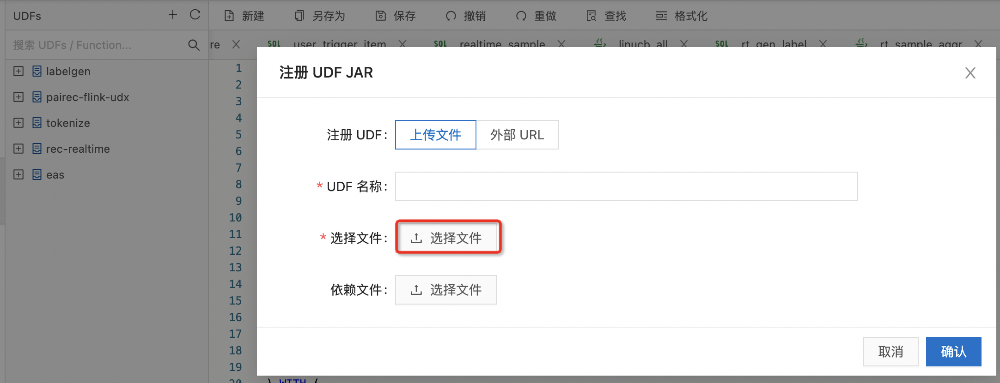

# 样本

## 离线样本
- 离线样本可以使用SQL在MaxCompute或者Hive/Spark平台上构造. 
- 可以使用 [推荐算法定制](https://pairec.yuque.com/books/share/72cb101c-e89d-453b-be81-0fadf09db4dd?#) 来自动生成离线特征 和 离线样本的流程.

## 实时样本

### 前置条件
- 服务开通: 
   - 除了MaxCompute, OSS, Dataworks, Hologres, 需要额外开通Flink, Datahub(或者Kafka) 
   - 产品具体开通手册，参考PAI-REC最佳实践里面的[开通手册](https://pairec.yuque.com/staff-nodpws/kwr84w/wz2og0)

### 数据准备
- 用户行为实时流
   - 通过datahub接入
   - 包含字段:
      - event_type, 事件类型: exposure / click / buy / like / play /...
      - event_time, 时间发生时间
      - duration, 持续时间，可选
      - request_id, 请求id
      - user_id, 用户id
      - item_id, 商品id
      - 其他信息，可选
- 特征埋点(callback)
   - 需要推荐引擎[如PAI-REC]开启callback落特征功能, 将特征保存在holo表

### 样本生成

1. 样本Events聚合(OnlineSampleAggr):
   - 上传资源包: [rec-realtime-0.8-SNAPSHOT.jar](http://easyrec.oss-cn-beijing.aliyuncs.com/deploy/rec-realtime-0.8-SNAPSHOT.jar)
     

   - flink配置:
     ```sql
       datahub.endpoint: 'http://dh-cn-beijing-int-vpc.aliyuncs.com/'
       datahub.accessId: xxx 
       datahub.accessKey: xxx
       datahub.inputTopic: user_behavior_log
       datahub.sinkTopic: odl_sample_aggr
       datahub.projectName: odl_sample
       datahub.startInMs: '1655571600'
       
       input.userid: user_id
       input.itemid: item_id
       input.request-id: request_id
       input.event-type: event
       input.event-duration: play_time
       input.event-ts: ts
       input.expose-event: exposure
       input.event-extra: 'scene'
       input.wait-positive-secs: '900'
     ```

      - datahub参数配置
         - accessId: 鉴权id
         - accessKey: 鉴权secret
         - projectName: 项目名称
         - endpoint: 使用带vpc的endpoint
         - inputTopic: 读取的datahub topic
         - sinkTopic: 写入的datahub topic
         - startInSecs: 开始读取的位点,单位是seconds
      - input: datahub schema配置
         - userid: userid字段名
         - itemid: itemid字段名
         - request-id: request_id字段名
         - event-duration: event持续时间
         - event-type: event类型字段
         - event-ts: event发生时间字段(seconds)
         - expose-event: 曝光事件类型
           - 曝光事件延迟不再下发
           - 其它事件延迟会补充下发
         - event-extra: 其它event相关字段,多个字段以","分割
         - wait-positive-secs: 等待正样本的时间, 单位是seconds
      - datahub topic schema:
         - inputTopic: user_behavior_log
           <table class="docutils" border=1>
           <tr><th> request_id </th><th> user_id </th><th> item_id </th><th> play_time </th><th> event  </th><th>  ts    </th><th> scene  </th><th> ... </th> 
           <tr><td>   string   </td><td>  string </td><td>  string </td><td>   double  </td><td> string </td><td> bigint </td><td> string </td><td> ... </td> 
           </table>
         - sinkTopic: odl_sample_aggr
           <table class="docutils" border=1>
            <tr> <th>request_id </th><th> user_id </th><th> item_id </th><th> events </th></tr> 
            <tr> <td>  string   </td><td>  string </td><td> string  </td><td> string </td></tr> 
           </table>
         - events数据格式:
           ```json
           [
            {"duration":6493,"eventTime":1659667790,"eventType":"play","properties":{"scene":"main"}},
            {"duration":6259,"eventTime":1659667796,"eventType":"play","properties":{"scene":"main"}}
           ]
           ```

2. label生成,  目前提供三种[udf](http://easyrec.oss-cn-beijing.aliyuncs.com/deploy/label_gen.zip):
   - playtime: sum_over(events, 'playtime')
   - click:  has_event(events, 'click')
   - min_over / max_over: min_over(events, 'eventTime') 
   - 可以使用python自定义任意udf, [参考文档](https://flink.apache.org/2020/04/09/pyflink-udf-support-flink.html) 
   - udf 上传([vvp-console](https://vvp.console.aliyun.com/)): 
        
   - 示例:
     ```sql
       insert into odl_sample_with_lbl
       select request_id, user_id, item_id,
           ln(if(playtime < 0, 0, playtime) + 1) as ln_play_time,
           cast((playtime > 10 or is_like > 0) as bigint) as is_valid_play,
           is_like, ts
       from (
           select *, sum_over(events, 'duration', TRUE) / 1000.0 as playtime,
               has_event(events, 'likes') as is_like,
               min_over(events, 'eventTime') as ts
           from odl_sample_aggr
       ); 
     ```

3. 样本join全埋点特征
   ```sql
     create temporary view sample_view as
     select a.request_id, a.user_id, a.item_id, a.ln_play_time, a.is_valid_play, feature, b.request_time
     from  odl_sample_with_lbl a
     inner join (
          select * from (
           select request_id, item_id, request_time, generate_features as feature, ts,
             row_number() over(partition by request_id, item_id order by proctime() asc) as rn
           from odl_callback_log
           where `module` = 'item' and (generate_features is not null and generate_features <> '')
          ) where rn = 1
     ) b
     on a.request_id = b.request_id and a.item_id = b.item_id
     where a.ts between b.ts - INTERVAL '30' SECONDS  and b.ts + INTERVAL '30' MINUTE;
   ```
   - 全埋点特征表odl_callback_log
     - 需要部署EAS callback服务, 服务配置和[EAS打分服务](./rtp_fg.md#id9)一致
       - 单独部署EAS callback服务的原因是避免影响EAS打分服务的性能
       - EAS callback对rt的要求低于EAS打分服务
     - 通过[PAI-REC推荐引擎](http://pai-vision-data-hz.oss-cn-zhangjiakou.aliyuncs.com/pairec/docs/pairec/html/intro/callback_api.html?highlight=callback)写入Datahub
       - PAI-REC[配置](./pai_rec_callback_conf.md)
     - Custom推荐引擎:
       - 调用EAS服务获取全埋点特征, 调用方式[参考文档](./rtp_fg.md#id10)
         - 请求的item list为下发列表,不是排序阶段的列表
         - EasyrecRequest.setDebugLevel(3)
       - 通过PBResponse.getGenerateFeaturesMap获取生成的特征
       - 特征写入Datahub topic: odl_callback_log.
   - odl_callback_log需要做去重, 防止因为重复调用造成样本重复
   - flink配置开启ttl(millisecond), 控制state大小:
     ```sql
       table.exec.state.ttl: '2400000'
     ```
     - ttl(miliseconds)的设置考虑两个因素:
       - odl_sample_with_lbl相对请求时间request_time的延迟
         - ttl < 相对延迟, 就会有样本丢失
         - 统计相对延迟:
           - 将odl_sample_with_lbl / odl_callback_log落到MaxCompute
           - 按request_id join 计算ts的差异
       - ttl越大state越大, 保存checkpoint时间越长, 性能下降
   - 存储引擎开启gemini kv分离(generate_features字段值很大):
     ```sql
       state.backend.gemini.kv.separate.mode: GLOBAL_ENABLE
       state.backend.gemini.kv.separate.value.size.threshold: '500'
     ```

4. 实时样本写入Datahub / Kafka
   ```sql
     create temporary table odl_sample_with_fea_and_lbl(
       `request_id`    string,
       `user_id`        string,
       `item_id`          string,
       `ln_play_time`  double,
       `is_valid_play` bigint,
       `feature`       string,
       `request_time`  bigint
     ) WITH (
       'connector' = 'datahub',
       'endPoint' = 'http://dh-cn-beijing-int-vpc.aliyuncs.com/',
       'project' = 'odl_sample',
       'topic' = 'odl_sample_with_fea_and_lbl',
       'subId' = '1656xxxxxx',
       'accessId' = 'LTAIxxxxxxx',
       'accessKey' = 'Q82Mxxxxxxxx'
     );
     insert into odl_sample_with_fea_and_lbl
     select * from sample_view;
   ```
   - subId: datahub subscription id

### 数据诊断
- 实时样本需要关注下面的信息和离线是否一致:
  - 样本总量: 因为样本延迟和全埋点特征join不上，导致样本量下降，需要增加interval join的区间和state ttl
  - 正负样本比例: 因为正样本延迟到达导致的延迟下发导致在线正样本占比偏低, 增加wait-positive-secs
  - 特征一致性: EAS callback服务和EAS打分引擎配置是否一样.

- 校验方法:
  - 实时样本落到maxcompute, 和离线的数据作对比
  - EasyRec训练的summary里面查看label的正负样本比
    

### 实时训练
- 启动训练: [文档](../online_train.md)
