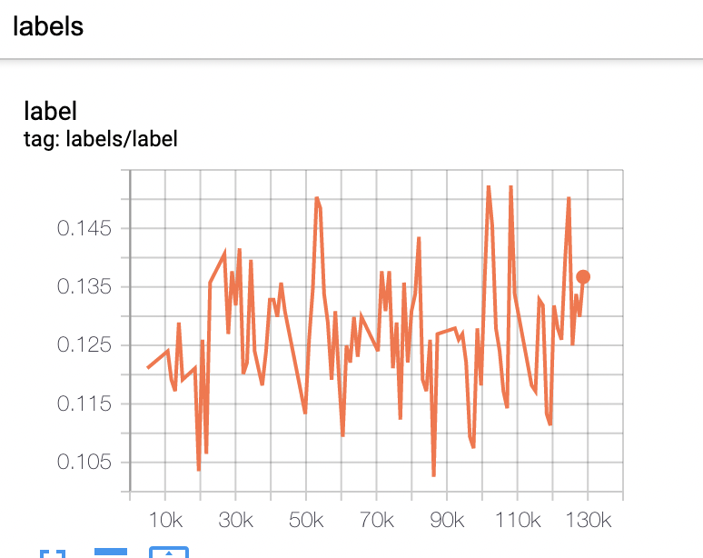

# 实时样本

## 前置条件
- 服务开通: 
   - 除了MaxCompute, OSS, Dataworks, Hologres, 需要额外开通Flink, Datahub(或者Kafka) 
   - 产品具体开通手册，参考PAI-REC最佳实践里面的[开通手册](https://pairec.yuque.com/staff-nodpws/kwr84w/wz2og0)

## 数据准备
- 用户行为实时流
   - 通过datahub接入
   - 包含字段:
      - event_type, 事件类型: exposure / click / buy / like / play /...
      - event_time, 时间发生时间
      - duration, 持续时间，可选
      - request_id, 请求id
      - user_id, 用户id
      - item_id, 商品id
      - 其他信息，可选
- 特征埋点(callback)
   - 需要推荐引擎[如PAI-REC]开启callback落特征功能, 将特征保存在holo表

## 样本生成

1. 样本Events聚合(OnlineSampleAggr):
   - 上传资源包: rec-realtime-0.8-SNAPSHOT.jar
     

   - flink配置:
     ```sql
       datahub.endpoint: 'http://dh-cn-beijing-int-vpc.aliyuncs.com/'
       datahub.accessId: 
       datahub.accessKey: 
       datahub.inputTopic: 
       datahub.sinkTopic: 
       datahub.projectName: 
       datahub.startInMs: '1655571600'
       
       input.userid: userid
       input.itemid: svid
       input.request-id: request_id
       input.event-type: event
       input.event-duration: play_time
       input.event-ts: ts
       input.expose-event: exposure
       input.event-extra: 'scene,exp_id'
       input.wait-positive-secs: '900'
     ```

      - datahub参数配置
         - accessId: 鉴权id
         - accessKey: 鉴权secret
         - projectName: 项目名称
         - endpoint: 使用带vpc的endpoint
         - inputTopic: 读取的datahub topic
         - sinkTopic: 写入的datahub topic
         - startInMs: 开始读取的位点,单位为seconds
      - input: datahub schema配置
         - userid: userid字段名
         - itemid: itemid字段名
         - request-id: request_id字段名
         - event-duration: event持续时间
         - event_type: event类型字段
         - event-ts: event发生时间字段
         - event-extra: 其它event相关字段
         - wait-positive-secs: 等待正样本的时间

2. label生成,  目前提供三种udf:
   - playtime: sum_over(events, 'playtime')
   - click:  has_event(events, 'click')
   - min_over / max_over: 
   - 可以使用python自定义任意udf, 示例: 
     ```sql
       @udf(result_type=DataTypes.BIGINT())
       def min_over(data: str, key: str):
         events = json.loads(data)
         min_val = sys.maxsize
         for ev in events:
           tmp_val = ev.get(key, min_val)
           if tmp_val < min_val:
             min_val = tmp_val
         return min_val
     ```
   - udf 上传([https://vvp.console.aliyun.com/](https://vvp.console.aliyun.com/)): 
        

3. 样本join全埋点特征
   ```sql
     create temporary view sample_view as
     select a.request_id, a.userid, a.item_id, a.ln_play_time, a.is_valid_play, feature, b.request_time
     from  sv_sample_with_lbl a
     inner join (
          select * from (
           select request_id, item_id, request_time, generate_features as feature, ts,
             row_number() over(partition by request_id, item_id order by proctime() asc) as rn
           from video_feed_callback_log
           where `module` = 'item' and (generate_features is not null and generate_features <> '')
          ) where rn = 1
     ) b
     on a.request_id = b.request_id and a.item_id = b.item_id
     where a.ts between b.ts - INTERVAL '30' SECONDS  and b.ts + INTERVAL '30' MINUTE;
   ```
   - 全埋点特征需要做去重, 防止因为重复调用造成样本重复
   - flink配置开启ttl, 控制state大小:
     ```sql
       table.exec.state.ttl: '2400000'
     ```
   - 存储引擎开启gemini kv分离(generate_features字段值很大):
     ```sql
       state.backend.gemini.kv.separate.mode: GLOBAL_ENABLE
       state.backend.gemini.kv.separate.value.size.threshold: '500'
     ```

4. 实时样本写入Datahub / Kafka
   ```sql
     create temporary table odl_sample_with_fea_and_lbl(
       `request_id`    string,
       `userid`        string,
       `item_id`          string,
       `ln_play_time`  double,
       `is_valid_play` bigint,
       `feature`       string,
       `request_time`  bigint
     ) WITH (
       'connector' = 'datahub',
       'endPoint' = 'http://dh-cn-beijing-int-vpc.aliyuncs.com/',
       'project' = 'odl_sample',
       'topic' = 'odl_sample_with_fea_and_lbl',
       'subId' = '16562305xxxxxx',
       'accessId' = 'LTAIxxxxxxx',
       'accessKey' = 'Q82mxxxxxxxx'
     );
     insert into sv_sample_with_fea_and_lbl
     select * from sample_view;
   ```
   - subId: datahub subscription id

## 实时训练
- 启动训练: [文档](../online_train.md)

## 部署EAS服务

- 配置和离线训练相同, [参考文档](./rtp_fg.md)
   - 使用modify的方式更新模型，能够防止模型出问题，服务全部挂掉
- 为了保证性能，需要设置time_key，以实现item特征的增量更新功能
- 使用oss挂载的方式加载模型，可以加快更新速度

## A/B实验
- 推荐引擎: 在推荐引擎[如PAI-REC]里面配置一个新的实验，更新[PAI-EAS服务配置](http://pai-vision-data-hz.oss-cn-zhangjiakou.aliyuncs.com/pairec/docs/pairec/html/config/algo.html)
- 和离线训练相同, 包含:
   - 天级报表
   - 小时级报表

## 数据诊断
实时样本需要关注下面的信息和离线是否一致:

1. 样本总量
1. 正负样本比例
1. 特征一致性

校验方法:

- 实时样本落到maxcompute, 和离线的数据作对比
- EasyRec训练的summary里面查看label的正负样本比



- 特征一致性
   - 和离线训练特征一致性校验一致
   - 需要重点关注实时特征一致性
