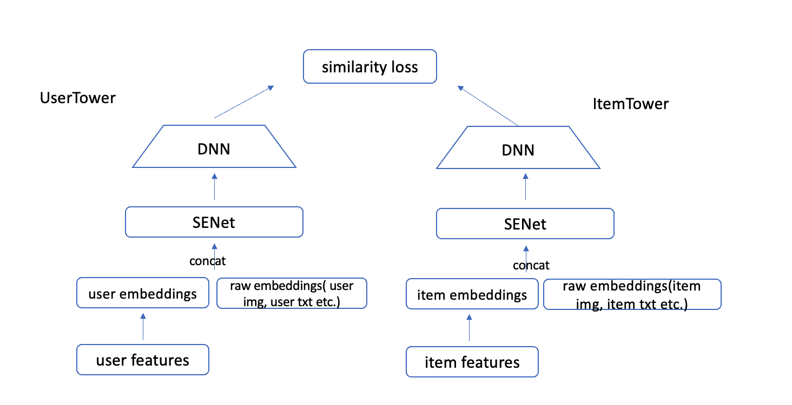

# DSSM衍生扩展模型

## DSSM + SENet

### 简介

在推荐场景中，往往存在多种用户特征和物品特征，特征类型各不相同，各种特征经过embedding层后进入双塔模型的DNN层进行训练，在部分场景中甚至还会引入多模态embedding特征, 如图像和文本的embedding。
然而各个特征对目标的影响不尽相同，有的特征重要性高，对模型整体表现影响大，有的特征则影响较小。因此当特征不断增多时，可以结合SENet自动学习每个特征的权重，增强重要信息到塔顶的能力。



### 配置说明

```protobuf
model_config:{
  model_class: "DSSM_SENet"
  feature_groups: {
    group_name: 'user'
    feature_names: 'user_id'
    feature_names: 'cms_segid'
    feature_names: 'cms_group_id'
    feature_names: 'age_level'
    feature_names: 'pvalue_level'
    feature_names: 'shopping_level'
    feature_names: 'occupation'
    feature_names: 'new_user_class_level'
    feature_names: 'tag_category_list'
    feature_names: 'tag_brand_list'
    wide_deep:DEEP
  }
  feature_groups: {
    group_name: "item"
    feature_names: 'adgroup_id'
    feature_names: 'cate_id'
    feature_names: 'campaign_id'
    feature_names: 'customer'
    feature_names: 'brand'
    #feature_names: 'price'
    #feature_names: 'pid'
    wide_deep:DEEP
  }
  dssm_senet {
    user_tower {
      id: "user_id"
      senet {
        num_squeeze_group : 2
        reduction_ratio: 4
      }
      dnn {
        hidden_units: [128, 32]
      }
    }
    item_tower {
      id: "adgroup_id"
      senet {
        num_squeeze_group : 2
        reduction_ratio: 4
      }
      dnn {
        hidden_units: [128, 32]
      }
    }
    simi_func: COSINE
    scale_simi: false
    temperature: 0.01
    l2_regularization: 1e-6
  }
  loss_type: SOFTMAX_CROSS_ENTROPY
  embedding_regularization: 5e-5
}
```

- senet参数配置:
  - num_squeeze_group: 每个特征embedding的分组个数， 默认为2
  - reduction_ratio: 维度压缩比例， 默认为4

### 示例Config

[dssm_senet_on_taobao.config](https://github.com/alibaba/EasyRec/tree/master/examples/configs/dssm_senet_on_taobao.config)

[dssm_senet_on_taobao_backbone.config](https://github.com/alibaba/EasyRec/tree/master/samples/model_config/dssm_senet_on_taobao_backbone.config)

### 参考论文

[Squeeze-and-Excitation Networks](https://arxiv.org/abs/1709.01507)
