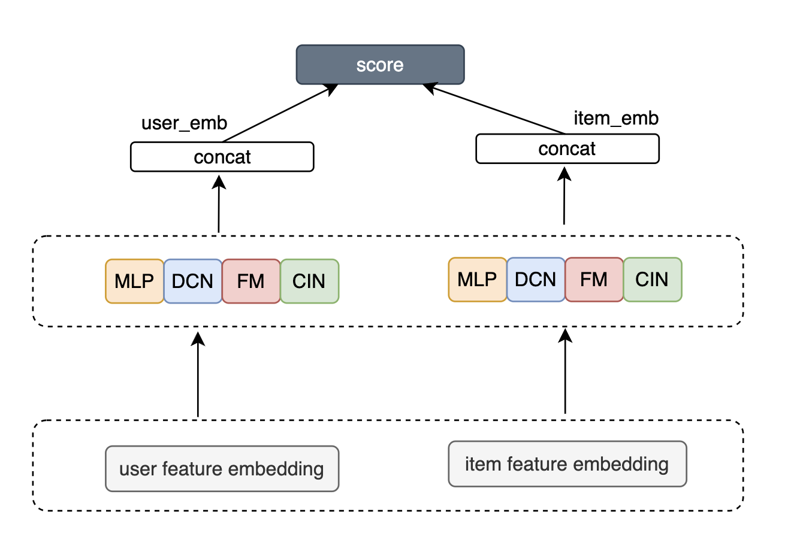

# DSSM衍生扩展模型

## 1. DSSM + SENet

### 简介

在推荐场景中，往往存在多种用户特征和物品特征，特征类型各不相同，各种特征经过embedding层后进入双塔模型的DNN层进行训练，在部分场景中甚至还会引入多模态embedding特征, 如图像和文本的embedding。
然而各个特征对目标的影响不尽相同，有的特征重要性高，对模型整体表现影响大，有的特征则影响较小。因此当特征不断增多时，可以结合SENet自动学习每个特征的权重，增强重要信息到塔顶的能力。


### 配置说明

```protobuf
model_config:{
  model_class: "DSSM_SENet"
  feature_groups: {
    group_name: 'user'
    feature_names: 'user_id'
    feature_names: 'cms_segid'
    feature_names: 'cms_group_id'
    feature_names: 'age_level'
    feature_names: 'pvalue_level'
    feature_names: 'shopping_level'
    feature_names: 'occupation'
    feature_names: 'new_user_class_level'
    feature_names: 'tag_category_list'
    feature_names: 'tag_brand_list'
    wide_deep:DEEP
  }
  feature_groups: {
    group_name: "item"
    feature_names: 'adgroup_id'
    feature_names: 'cate_id'
    feature_names: 'campaign_id'
    feature_names: 'customer'
    feature_names: 'brand'
    #feature_names: 'price'
    #feature_names: 'pid'
    wide_deep:DEEP
  }
  dssm_senet {
    user_tower {
      id: "user_id"
      senet {
        num_squeeze_group : 2
        reduction_ratio: 4
      }
      dnn {
        hidden_units: [128, 32]
      }
    }
    item_tower {
      id: "adgroup_id"
      senet {
        num_squeeze_group : 2
        reduction_ratio: 4
      }
      dnn {
        hidden_units: [128, 32]
      }
    }
    simi_func: COSINE
    scale_simi: false
    temperature: 0.01
    l2_regularization: 1e-6
  }
  loss_type: SOFTMAX_CROSS_ENTROPY
  embedding_regularization: 5e-5
}
```

- senet参数配置:
  - num_squeeze_group: 每个特征embedding的分组个数， 默认为2
  - reduction_ratio: 维度压缩比例， 默认为4

### 示例Config

[dssm_senet_on_taobao.config](https://github.com/alibaba/EasyRec/tree/master/examples/configs/dssm_senet_on_taobao.config)

[dssm_senet_on_taobao_backbone.config](https://github.com/alibaba/EasyRec/tree/master/samples/model_config/dssm_senet_on_taobao_backbone.config)

### 参考论文

[Squeeze-and-Excitation Networks](https://arxiv.org/abs/1709.01507)

## 2. 并行DSSM

在召回中，我们希望尽可能把不同的特征进行交叉融合，以便提取到隐藏的信息。而不同的特征提取器侧重点不尽相同，比如MLP是隐式特征交叉，FM和DCN都属于显式、有限阶特征交叉, CIN可以实现vector-wise显式交叉。因此可以让信息经由不同的通道向塔顶流动，每种通道各有所长，相互取长补短。最终将各通道得到的Embedding聚合成最终的Embedding，与对侧交互，从而提升召回的效果。



### 示例Config

[parallel_dssm_on_taobao_backbone.config](https://github.com/alibaba/EasyRec/tree/master/samples/model_config/parallel_dssm_on_taobao_backbone.config)

## 3. 对偶增强双塔 Dual Augmented Two-Tower

双塔模型对用户和物品的特征分开进行建模，在对特征进行了多层神经网络的整合后进行交互。由于网络的整合可能会损失一部分信息，因此过晚的user/item交互不利于模型的学习，这也是DSSM的一个主要的弊端。在对偶增强双塔算法中，作者设计了一个辅助向量，通过学习对user和item进行增强，使得user和item的交互更加有效。


### 配置说明

作为DSSM的衍生模型，DAT的配置与DSSM类似，在model_config中除了user和item的feature_group外，还需要增加user_id_augment feature_group和item_id_augment feature_group, 作为模型输入的增强向量。
两塔各自的DNN最后一层输出维度需要和user_id_augment的embedding维度保持一致，以便构造AMM损失（Adaptive-Mimic Mechanism）。

```
  feature_groups: {
    group_name: 'user_id_augment'
    feature_names: 'user_id'
    wide_deep:DEEP
  }
  feature_groups: {
    group_name: 'item_id_augment'
    feature_names: 'adgroup_id'
    wide_deep:DEEP
  }

  dat {
    user_tower {
      id: "user_id"
      dnn {
        hidden_units: [ 128,  32]
        # dropout_ratio : [0.1, 0.1, 0.1, 0.1]
      }
    }
    item_tower {
      id: "adgroup_id"
      dnn {
        hidden_units: [ 128, 32]
      }
    }
    simi_func: COSINE
    temperature: 0.01
    l2_regularization: 1e-6
  }
```

### 示例Config

[dat_on_taobao.config](https://github.com/alibaba/EasyRec/tree/master/samples/model_config/dat_on_taobao.config)

### 参考论文

[A Dual Augmented Two-tower Model for Online Large-scale Recommendation](https://dlp-kdd.github.io/assets/pdf/DLP-KDD_2021_paper_4.pdf)
