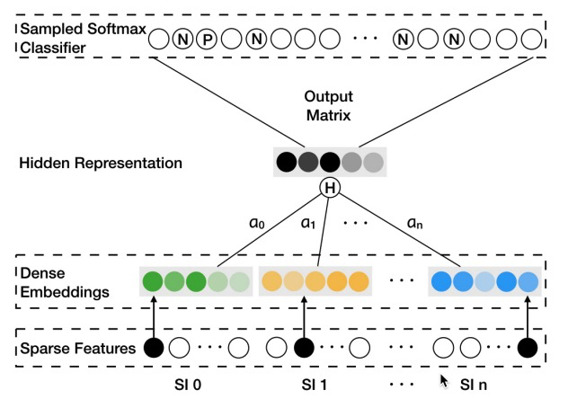

# EGES

### 简介

图i2i召回模型, 通过在图上随机游走生成随机路径，然后在路径上使用skip-gram算法进行训练.



### 配置说明
#### 输入配置
```protobuf
graph_train_input {
  node_inputs: 'data/test/graph/taobao_data/ad_feature_5k.csv'
  edge_inputs: 'data/test/graph/taobao_data/graph_edges.txt'
}

graph_eval_input {
  node_inputs: 'data/test/graph/taobao_data/ad_feature_5k.csv'
  edge_inputs: 'data/test/graph/taobao_data/graph_edges.txt'
}
```
- node_inputs: 图中的节点为item, 这个输入给出了item的节点id, weight(采样时使用)和feature(side info)信息
  - 示例输入如下:
    ```
    id:int64	weight:float	feature:string
    521512		1		521512,4282,173332,237,NULL,298.0
    476210		1		476210,4292,418411,515,377957,249.0
    646682		1		646682,7205,365036,676,321803,9.9
    ...
    ```
- edge_inputs: 图中的边描述item在同一个session共现的频率
  - 示例输入如下:
    ```
    src_id:int64	dst_id:int64	weight:float
    565248		565248		100
    565248		786433		2
    565248		638980		20
    ...
    ```
- node_inputs和edge_inputs在MaxCompute上的输入类似，每一列存放成一个column
  - node表包含3列:id, weight, feature
  - edge表包含3列:src_id, dst_id, weight
  - int64对应的类型是bigint
  - float对应的类型是double
  - string对应的类型是string

#### 数据配置
```protobuf
data_config {
  input_fields {
    input_name: 'adgroup_id'
    input_type: STRING
  }
  input_fields {
    input_name: 'cate_id'
    input_type: STRING
  }
  input_fields {
    input_name: 'campaign_id'
    input_type: STRING
  }
  input_fields {
    input_name: 'customer'
    input_type: STRING
  }
  input_fields {
    input_name: 'brand'
    input_type: STRING
  }
  input_fields {
    input_name: 'price'
    input_type: DOUBLE
  }

  graph_config {
    random_walk_len: 10
    window_size: 5
    negative_num: 10
    directed: true
  }

  batch_size: 64
  num_epochs: 2
  prefetch_size: 32
  input_type: GraphInput
}
```

- input_fields:
  - input_name: 输入特征名, 对应odps表的字段名或者csv文件的header名(如果没有header,按照字段顺序一一对应)
  - input_type: 数据类型, STRING, DOUBLE, INT32, INT64, 不设置默认为STRING
- graph_config: 图上随机游走相关的参数
  - walk_len: 随机游走的长度
  - window_size: skip-gram的窗口大小
  - negative_num: 负采样时每个正样本对应的负样本数目
  - directed: 是否是有向图, 默认是false
- batch_size: 随机游走起始节点的数量
- num_epochs: 数据过多少遍
- prefetch_size: 数据预取的batch_size数目
- input_type: 输入数据格式，针对图类型的算法默认为GraphInput

#### 特征配置
```protobuf
feature_config: {
  features: {
    input_names: 'adgroup_id'
    feature_type: IdFeature
    embedding_dim: 16
    hash_bucket_size: 100000
  }
  features: {
    input_names: 'cate_id'
    feature_type: IdFeature
    embedding_dim: 16
    hash_bucket_size: 10000
  }
  ...
  features: {
    input_names: 'brand'
    feature_type: IdFeature
    embedding_dim: 16
    hash_bucket_size: 100000
  }
  features: {
    input_names: 'price'
    feature_type: RawFeature
  }
}
```
- features.input_names: 特征的输入，对应data_config.input_fields.input_name

#### 模型配置
```protobuf
model_config:{
  model_class: "EGES"

  feature_groups: {
    group_name: "item"
    feature_names: 'adgroup_id'
    feature_names: 'cate_id'
    feature_names: 'campaign_id'
    feature_names: 'customer'
    feature_names: 'brand'
    feature_names: 'price'
    wide_deep:DEEP
  }
  eges {
    dnn {
      hidden_units: [256, 128, 64, 32]
    }
    l2_regularization: 1e-6
  }
  loss_type: SOFTMAX_CROSS_ENTROPY
  embedding_regularization: 0.0

  group_as_scope: true
}
```
- model_class: 默认为EGES
- feature_groups: 特征组，需要配置一个特征组, group_name为item，不能变
  - feature_names: 对应data_config.features.input_names[0](或者feature_name, 如果有设置)
- eges: dnn为特征变换mlp
- loss_type: SOFTMAX_CROSS_ENTROPY，因为有负采样在
- group_as_scope: 使用group_name作为embedding等variable的scope_name,建议设置成true

### 示例Config
[EGES_demo.config](https://easyrec.oss-cn-beijing.aliyuncs.com/config/eges_on_taobao.config)

### 参考论文
[EGES.pdf](https://arxiv.org/pdf/1803.02349.pdf)
