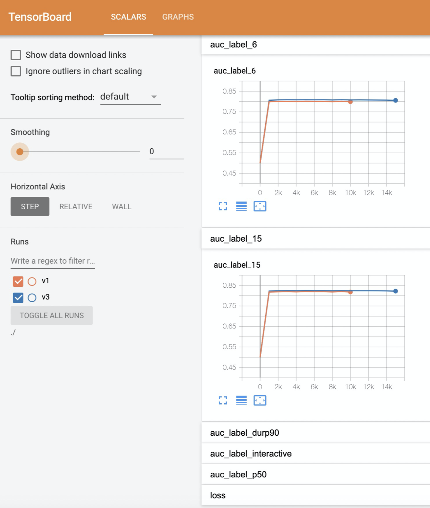
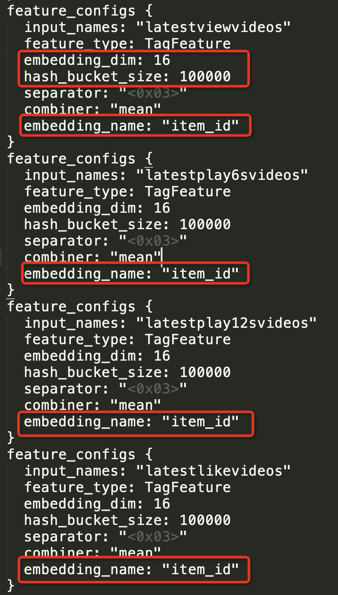
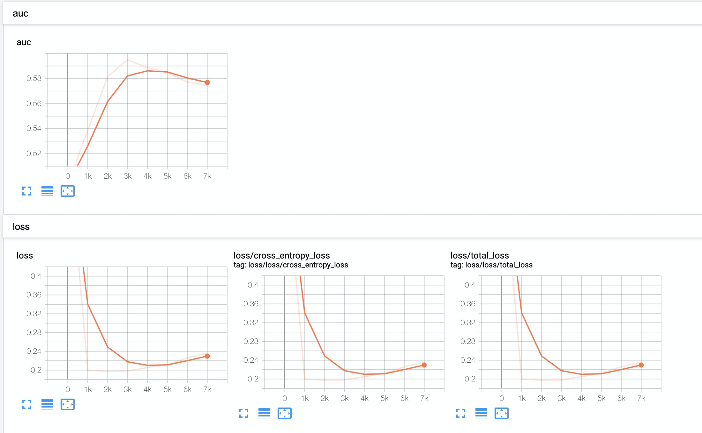
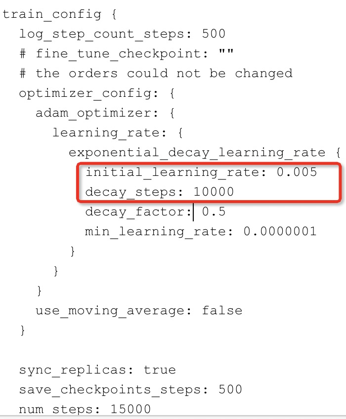
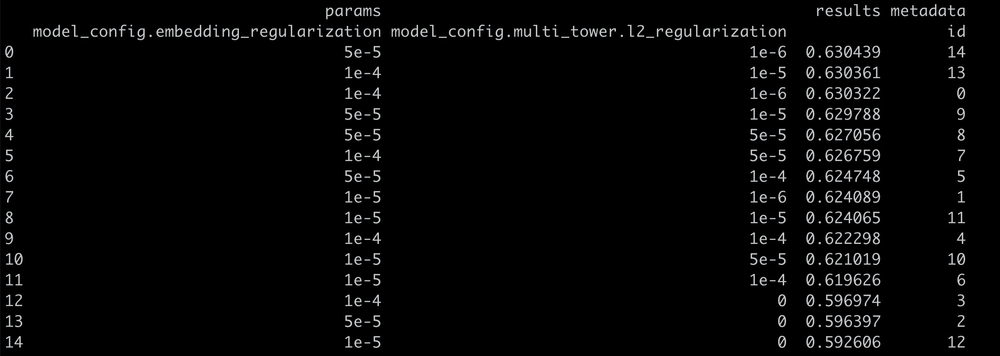

# 优化

### 1.利用tensorboard看模型效果。

利用tensorboard，可以看到eval worker(默认 worker1)对于评估集上，各个save_checkpoints_steps上的表现。
方法：

1. 将events文件下载到本地（events文件在model_dir/eval_val/ 路径下）

1. 本地使用tensorboard命令打开events文件（注：events_file_path不能指定events文件，需指定到events文件的父目录）

   ```
   tensorboard --logdir=events_file_path
   ```



### 2.num_steps的设置方法

可以先设置个较大值，如5w，然后利用tensorboard观察收敛效果。
若1w步时一收敛到最优，则调整num_steps到1w-2w。

### 3.shuffle

在训练模型前, 对训练数据先进行打散(shuffle)，往往能得到更高的指标，训练过程也更稳定。
（注：只需shuffle训练表，无需shuffle评估表）

```sql
create table train_table_shuffled
as
select * from train_table
DISTRIBUTE by rand();
```

### 4.share embedding

将指定特征共享embedding空间，达到节省参数空间，加快收敛，防止过拟合。

- 共享embedding的feature_configs中，**embedding_dim，hash_bucket_size，embedding_name等参数要保证一致**。
  

### 5.根据模型效果，相应调整模型参数

**过拟合：**


做法：

1. 减小embeddding size，建议8-16之间；
1. 增加正则化参数，包括l2_regularization，embedding_regularization，建议在1e-7到1e-5之间；
1. 增大dropout；
1. 减小网络，包括层数和hidden_units。

**欠拟合：**

做法：

1. 增大embeddding size；
1. 减小正则化参数，包括l2_regularization，embedding_regularization；
1. 减小dropout；
1. 扩大网络。

**学习缓慢：**

做法：

1. 加大学习率(initial_learning_rate)，同时调整学习率衰减(decay_steps/decay_factor)
   

### 6.hpo调参

具体参考：[pai-hpo调参](automl/hpo_pai.md)

主要调参项：

- embedding_dim
- lr, decay
- l2_regularization, embedding_regularization



### 7.导出最优模型

```
export_config {
  exporter_type: "best"
  exports_to_keep: 1
  best_exporter_metric: "auc"
}
```
