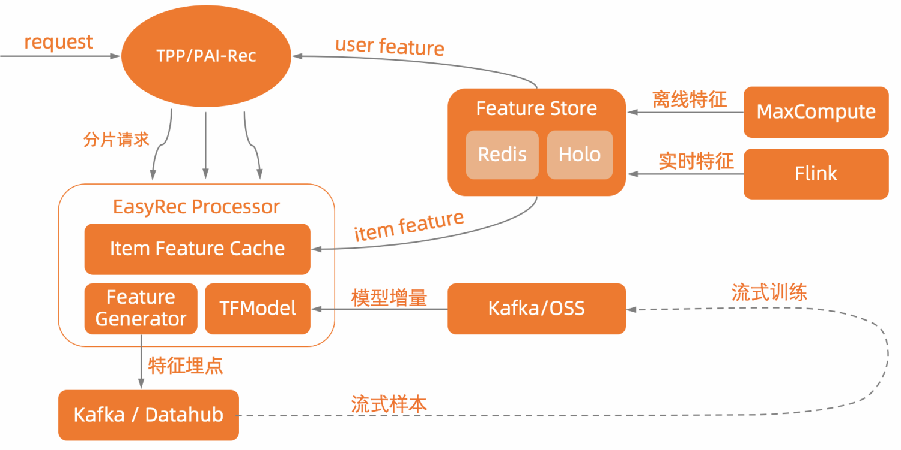
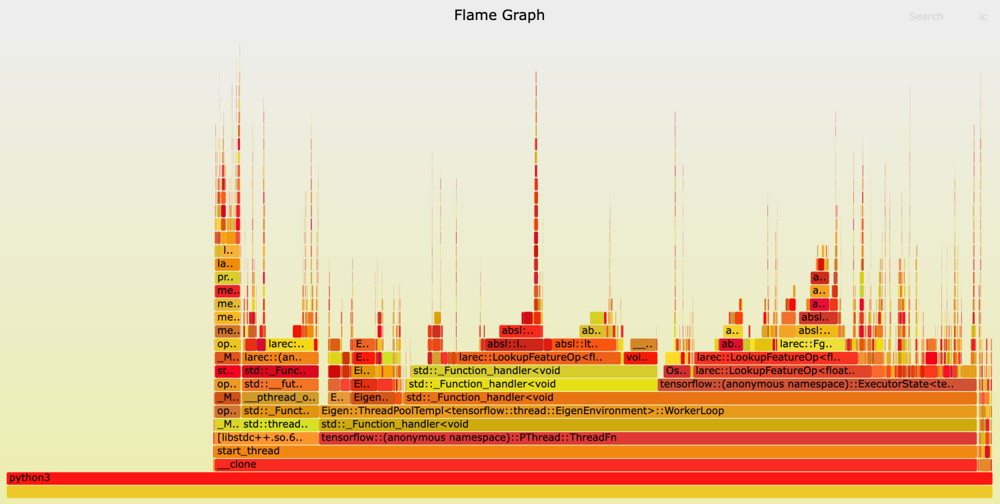

# EasyRec Processor

EasyRec Processor, 是EasyRec对应的高性能在线打分引擎, 包含特征处理和模型推理功能. EasyRecProcessor运行在PAI-EAS之上, 可以充分利用PAI-EAS多种优化特性.

## 架构设计

EasyRec Processor包含三个部分: Item特征缓存, 特征处理(Feature Generator), TFModel(tensorflow model).

## 性能优化

### 基础实现

将FeatureGenerator和TFModel分开, 先做特征生成，然后再Run TFModel.

### 优化实现

FeatureGenerator作为算子嵌入, 和TFModel联合优化，主要的优化点包括:

- Feature算子化
  - Feature算子直接输出SparseTensor, 减少String Concat, Copy, Split, ToSparseTensor开销
  - Feature算子和其他算子之间可以Overlap执行, 显著降低单个请求的时间
- Feature Tile后置
  - 在线推理User Feature的BatchSize = 1, 因此只需要计算一次, Tile可以放到UserFeature EmbeddingLookUp的后面，和EmbeddingLookUp融合起来
- EmbeddingLookup OpFusion
  - embedding lookup涉及到GatherV2 / SparseSegmentMean等多个小op, 使用OpFusion可以减少kernel launch以及Tensor内存分配和拷贝的开销
  - embedding lookup的过程需要用到比较多的SparseSegment Mean/Sum操作,  使用avx指令优化向量运算
- MatchFeature /  LookupFeature优化
  - 使用string_view代替std::string，减少string拷贝的开销
- Sequence特征优化
  - sequence特征建模通常需要带上side info才能取得比较好的效果, 将side info放在请求中传递过来会带来通信的开销, EasyRec Processor在客户侧缓存了item特征, 因此在请求中只传递item_id sequence, side info sequence通过item_id查找客户侧缓存构建.
- BFloat16支持
  - 推荐模型Embedding占了主要的部分, 使用BF16可以在不损失精度的情况下，减少一半的内存
  - 原生的BFloat到Float的转换效率很低，使用avx加速后，性能(tp99)提升1倍

## 性能对比

- 模型1:

  - 特征:

   <table class="docutils" border=1>
   <tr><th>id_feature</th><th>raw_feature</th><th>lookup_feature</th><th>sequence_feature</th></tr>
   <tr><td> 67 </td><td> 170 </td><td> 756 </td> <td>main seq num: 4 | sideinfo seq num: 32 | max seq len: 50 </td></tr>
   </table>

  - 请求信息:
    - batch_size: 100
    - bytes: 平均50k
  - 硬件:
    - CPU核数: 10
    - CPU型号: [IceLake](https://help.aliyun.com/document_detail/68564.html#p-zpg-gvj-g91)
  - 测试结果:

   <table class="docutils" border=1>
   <tr><th></th><th>CPU利用率</th><th>QPS</th><th>AVG RT</th><th>TP99</th></tr>
   <tr><td>优化前</td><td>96 </td><td> 20   </td><td> 247ms </td><td> 333ms </td></tr>
   <tr><td>优化后</td><td>91 </td><td> 55   </td><td> 86ms  </td><td> 113ms </td></tr>
   <tr><td>提升  </td><td>   </td><td> 175% </td><td> 65%   </td><td> 66%   </td></tr>
   </table>

- 模型2:

  - 特征数:

   <table class="docutils" border=1>
   <tr><th> id_feature </th><th> raw_feature </th><th> lookup_feature </th><th> match_feature </th></tr>
   <tr><td> 306 </td><td>  77 </td><td>  60 </td><td> 1000 </td></tr>
   </table>

  - 请求信息:
    - batch_size: 150
    - bytes: 平均500k
  - 硬件:
    - CPU核数: 15
    - CPU型号: [IceLake](https://help.aliyun.com/document_detail/68564.html#p-zpg-gvj-g91)
  - 测试结果:

   <table class="docutils" border=1>
     <tr><th></th><th> CPU利用率 </th><th> QPS </th><th> AVG RT </th><th> TP99 </th></tr>
     <tr><td> 优化前 </td><td> 89 </td><td> 33   </td><td> 288 </td><td> 362</td></tr>
     <tr><td> 优化后 </td><td> 93 </td><td> 226  </td><td> 34  </td><td> 57 </td></tr>
     <tr><td> 提升   </td><td>    </td><td> 580% </td><td> 88% </td><td> 84%</td></tr>
   </table>

- 总结: 可以看出来, 优化实现比基础实现性能高出很多.

### 参考

#### 火焰图

- 优化前

可以看到特征生成之后还有较多的string处理，包括拷贝、拆分等, 占据了比较多的CPU时间

- 优化后

### Release

<table class="docutils" border=1>
  <tr><th>版本</th><th>说明</th></tr>
  <tr><td>easyrec</td><td>AVX Kernel优化; 支持向量召回引擎(Faiss向量引擎); 支持GPU推理</td></tr>
  <tr><td>easyrec-1.2</td><td>优化weighted category embedding</td></tr>
  <tr><td>easyrec-1.3</td><td>支持PAI-FeatureStore; 支持从max compute加载数据</td></tr>
  <tr><td>easyrec-1.4</td><td>优化keras model性能; input自动扩展; placement优化</td></tr>
  <tr><td>easyrec-1.5</td><td>graph pattern match bugfix</td></tr>
</table>

### 部署

[参考文档](./%E5%9C%A8%E7%BA%BF%E9%A2%84%E6%B5%8B.md)
